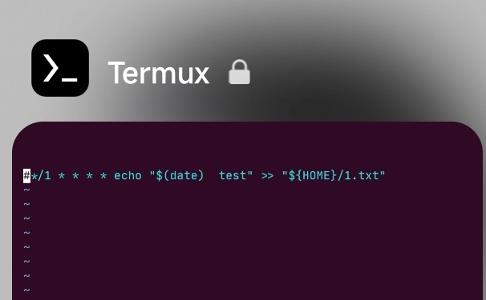
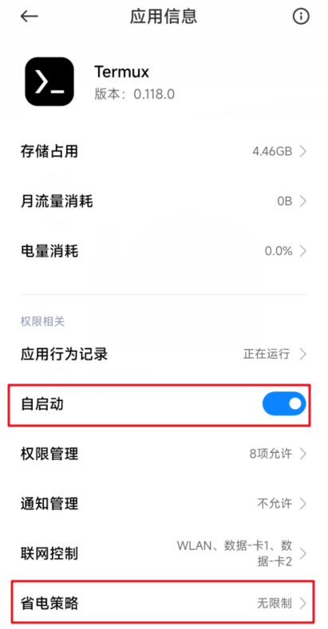
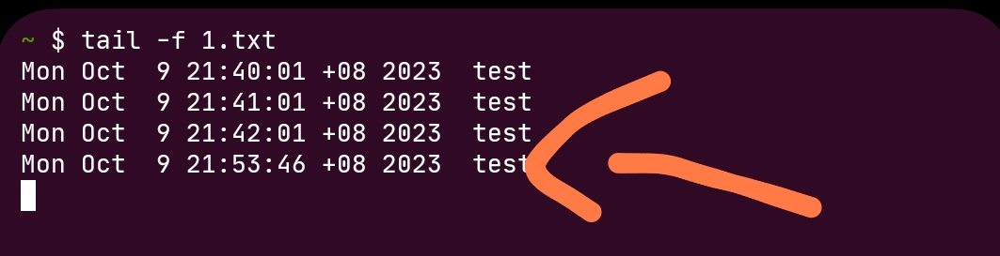
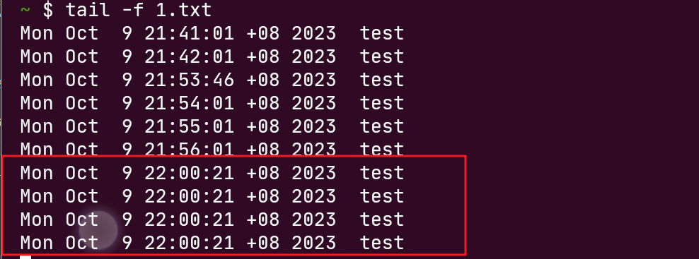
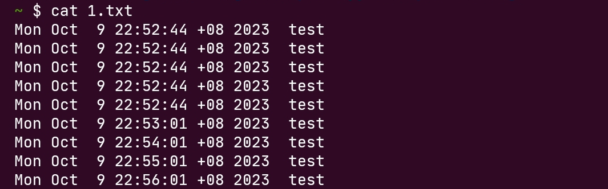

## 起因

因为我的红米k60pro 安装了 termux，而同时我想要定时执行一些命令，所以自然而然的想到了 linux 的 crontab 命令。


## 尝试

在 termux 中用于定时任务的包是 `cronie`

```bash
# 安装
pkg install cronie

# 进入编辑， 默认是 nano， 不想用nano，直接卸载，我只使用 vim
crontab -e

#### 每分钟在 $HOME 目录的 1.txt 文件写入 时间测试
*/1 * * * * echo "$(date)  test" >> "${HOME}/1.txt"
####

```

手机的 termux 设置加锁（清理进程时，不会被清除），开启自启动，开启省电策略无限制。






第一个测试场景：termux 使用 tail 命令 对 1.txt 文件进行监听的情况切后台，去b站看会视频，等待一段时间，重新切回 termux，发现立刻触发一次定时任务，保持 termux 前台状态，则每分钟定时触发。



第二个测试场景，termux 不做任何操作（比如 不使用 tail 命令 实时监听文件） 情况下切后台，去b站看会视频，等待一段时间，重新切回 termux， 此时使用 tail（图中，本来更好的应该是 cat，来显示区别）监听 1.txt， 发现堆积的定时任务被触发。 保持 termux 前台状态，则每分钟定时触发。



这样就导致了一个问题，那就是我需求就是想让 termux 后台自动触发定时任务，可是现状就是想要定时自动触发，那么 termux 必须在前台。


termux进程保活的操作都做了呀，那么肯定还有其他的问题。咨询万能的群友，由 @梦飞翔 告知， 红米手机现在也具有墓碑机制，于是在他的指点下，我进入**开发者选项**，找到**暂停执行已缓存的应用**，并且设置关闭。


它需要重启手机，接着重新测试，发现能够自动定时触发任务，原因找到了。



## 结论

由于墓碑机制导致后台进程被挂起。


1. 如果关闭这个设置，手机续航可能下降，耗电量增大。但支持 termux 的定时任务
2. 保持此设置默认或开启，手机续航提升，耗电量减少，想要支持 termux 的定时任务，只能放置前台（单独，分屏，小窗）
3. 放弃定时任务，选择手动执行相应的命令。

综合考虑，我选择 3， 还是手动执行命令吧。
