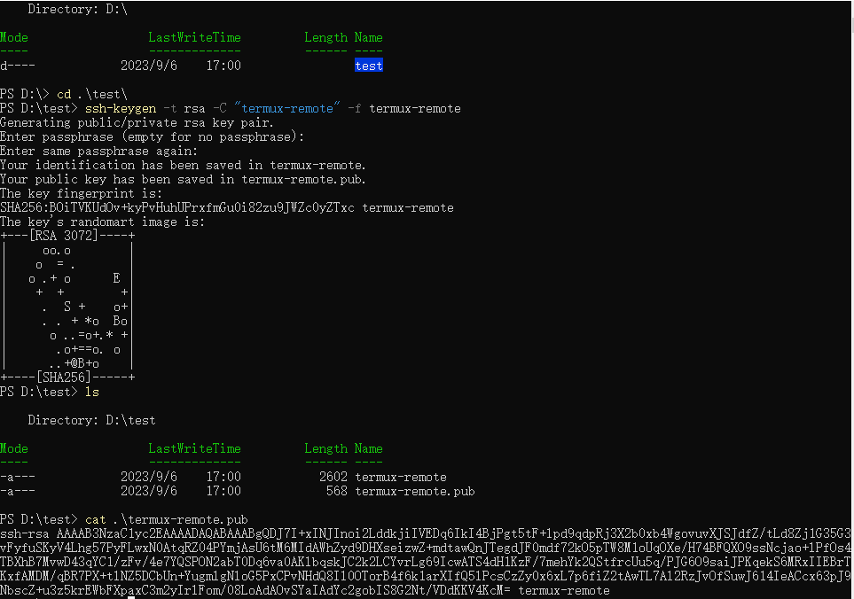

## 下载地址
[Github Termux](https://github.com/termux/termux-app/releases/tag/v0.118.0)

[f-droid Termux](https://f-droid.org/en/packages/com.termux/)

## 基本说明

Termux 上面的命令，大部分跟 Linux 命令相同。由于 Termux 只是模拟 Linux 环境，所以文件结构会跟标准的 Linux 文件目录不一致，详情参考 [Termux file system layout](https://github.com/termux/termux-packages/wiki/Termux-file-system-layout)。

1. `/data/data/com.termux/files/home` 即 `~` 主目录。建议所有操作在此目录下进行。
2. `/data/data/com.termux/files/usr` 即 `$PREFIX`。 所有适配 termux 的软件包，都需要把相应的程序、链接和配置映射到这个目录。
3. `/data/data/com.termux/files/home/storage` 内部存储访问目录，需要执行 `termux-setup-storage` 命令 ，并授权。此目录下会产生一系列的软链接，用于在 Termux 中访问内部存储并操作。


## 安装软件包

```bash

# 选择镜像源
termux-change-repo

# 更新软件源
pkg update
pkg upgrade

# 安装 vim openssh git nodejs
pkg install vim openssh git nodejs

# 生成 ssh 密钥
ssh-keygen -t rsa -b 2048 -C "<email or name>"
# 文件在 ~/.ssh 中默认是 id_rsa（私钥） 和 id_rsa.pub (公钥)

# 配置 git
git config --global user.name "<Your Name>"
git config --global user.email "<Your Email>"
# github 添加完公钥后，进行验证。
ssh -T git@github.com

# 配置文件在 ~/.gitconfig


# nodejs 换源 切换淘宝源
npm install -g nrm
npm ls
nrm use taobao

```

## ROOT

Termux 在大部分情况下，都可以非 root 模式执行。

在手机本身没有 root 的情况下，Termux 支持模拟一个 root 用户来进行操作，但事实上，他只是虚拟化了一个 linux 文件系统，并没有真正对手机系统的操作权限。

```bash
pkg install proot -y

# 进入 模拟 root 环境
termux-chroot

# 退出
exit
```
在手机本身已经 root 的情况，（比如使用 Magisk 获得了 root 权限），需要安装 `tsu` 来获取 root，此时软件是可以接管整个系统文件，属于高危操作。

```bash
pkg install tsu

# 切换 root 用户，第一次会弹出 Magisk 授权 root 提示框
su

whoami # 此时显示 root

# 退出 root 用户
exit

# 如果不想进入 root 用户，但使用 root 权限，则应该使用 sudo 命令
cd /
ls # 提示无权限
sudo ls # 正常显示
```


## 远程 SSH

我的使用场景是电脑和手机处于同一WIFI局域网下，电脑（window）通过 SSH 远程连接手机，此时电脑是客户端，手机是服务端。

出于安全考虑，仅选择密钥对的方式，来控制远程访问，只要保管好私钥，就可以确保手机安全，公钥上传到服务端，私钥保存在客户端。

在电脑上创建密钥对, 打开 powershell ，执行命令，复制公钥的内容到手机上（通过 QQ 发送）。


在手机上面导入公钥到 `~/.ssh/authorized_keys` 文件中，查看和配置相关的信息。

电脑使用 MobaXterm 等工具就可以远程连接了。

```powershell
# powershell 7

ssh-keygen -t rsa -C "termux-remote" -f termux-remote

cat ./termux-remote.pub

```

```bash
cd ~/.ssh

echo "<pub data>" >> authorized_keys

# 192 开头的为 wifi 局域网地址
ifconfig


# 查看当前用户
whomi

# 开启 sshd， 默认监听端口是 8022， 而不是 22 端口
sshd

# 配置 sshd 文件在 /data/data/com.termux/files/usr/etc/ssh/sshd_config

vim $PREFIX/etc/ssh/sshd_config

# 禁止 root 用户登录 和 密码登录
##################
# 可以更改监听端口
# ListenAddress: 0.0.0.0:2222
PermitRootLogin no
PrintMotd yes
PasswordAuthentication no
Subsystem sftp /data/data/com.termux/files/usr/libexec/sftp-server
#################

# 关闭 sshd 服务
pkill sshd
```




注：如果不处于同一网络,还想这么做，那么可能需要公网跳板机，以及内网穿透等工具，不在本文讨论范围。

## 其他

由于文件系统限制，涉及到 symbolic link 的操作可能失败。

主要表现：想在内部存储目录创建软链接，方便在手机的文件管理器中访问 termux 数据，但创建软链接失败。


但反过来可以，在 termux 主目录创建软链接，用于链接内部存储目录。

因此想共享数据，可以先再内部存储目录创建一个文件夹，然后在 termux 主目录中创建软链接。


即使可以共享数据，也不要想着在内部存储目录下去安装 npm 包，同样会失败。只有在 termux 目录下才能够正常安装和使用 npm 包。


##  参考文档

* [Termux Wiki Get Start](https://wiki.termux.com/wiki/Getting_started)
* [Termux file system layout](https://github.com/termux/termux-packages/wiki/Termux-file-system-layout)
* [NPM换源的方法](https://juejin.cn/post/7100751629820887047)
* [Termux Wiki Remote Access](https://wiki.termux.com/wiki/Remote_Access)
* [Is it possible to make work symlinks on mounted internal storage](https://github.com/termux/termux-app/issues/513)
* [Termux 高级终端安装使用配置教程 【推荐阅读，细致的配置教程】](https://www.sqlsec.com/2018/05/termux.html)


