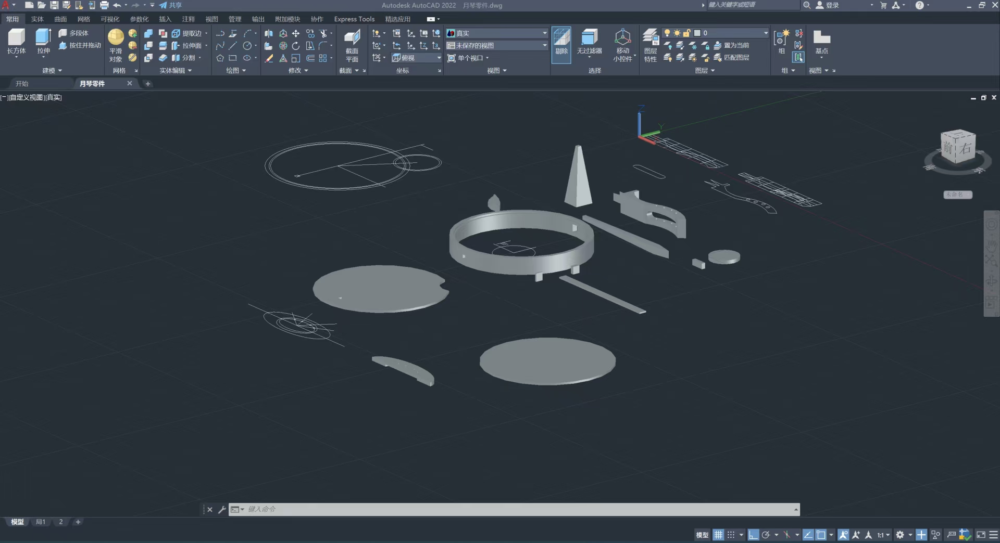
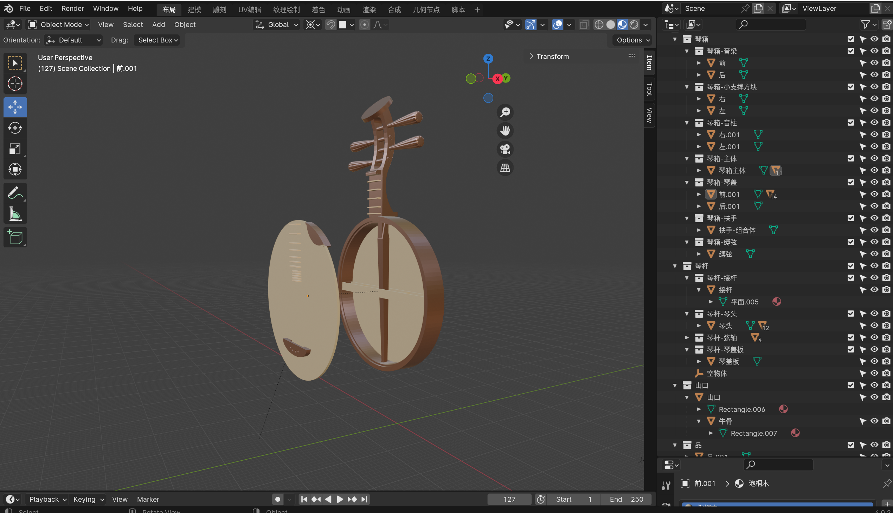

## 太长不看版

[自学 blender 10 天，一比一复刻月琴成果记录](https://www.bilibili.com/video/BV1dg4y127VA/)

## 起因

某一天，在网上看到这样一张照片，觉得很好看，去搜索了一下，发现这个乐器叫做月琴。

然后，我在群里问有没有什么简单的建模软件，得到的答案是 blender 。

后来，我才发现，这个软件确实很好用，但要用好也确实很难，不过对于当前的这个需求来说，不需要太复杂的知识。

##  尺寸数据

既然想法有了，软件也有了。那么下一步就是确定模型的具体尺寸。

我在 b 站发现相关的制作视频 [月琴的制作工艺](https://www.bilibili.com/video/BV11V4y1g718/)。

通过暂停和截图的方式，把主要的尺寸数据都保存下来了。 

但视频里也有一些数据是没有明确告知的，所以只能凭感觉使得整体模型看起来协调。

具体的数据都保存在这个文档中：[月琴制作的数据-语雀](https://www.yuque.com/zxlt/xdzber/ngyvt7ifwczkor7d?singleDoc#)

## blender 学习

blender 的学习主要参考了下面两个教程，非常的棒。两个教程都看到修改器和简单的材质部分。

* [Blender零基础入门教程 | Blender中文区新手必刷教程(已完结)](https://www.bilibili.com/video/BV14u41147YH/)

* [Blender4.0建模入门教程_超细节100集课程](https://www.bilibili.com/video/BV1fb4y1e7PD/)

边看视频，跟着做会很有成就感。

## CAD 补充

随着不断的了解 blender，我逐渐感觉到 blender 不是很适合精确建模。如果我想一比一复刻，那么最好应该选择其他的建模软件。

不过，针对这个需求来说， blender 是可以胜任，于是我决定继续学习并使用该软件。

但在此之前，我得先用 CAD 软件画出各个组件，来看看各个组件的尺寸是否合适，并进行调整。

## 成品展示

## 写在最后

终于想起了自己还有一个博客网站（不是），那就趁着现在还有时间，就更一篇吧。

我这两年算是尝试了很多自己以前没有机会或者没有时间去做的事情。

由于疫情期间一直在看带床去旅行的视频，于是我也真的去重装骑行了，这我目前做的最大胆的事情。

在骑行期间，我确确实实感受到自由，感受到万物的悸动，但说实话，我也放弃了很多东西，放弃了城市里安全和便利的生活，放弃了成长的机会。

我只是在这个年龄选择了不一样的过法，挖野菜，喝山泉水，露营在荒山野岭，在雪地里，大雨里，深山老林中骑行，经历不可谓不丰富。

我想我应该是不会后悔自己去做这些事情。

给看我博客的朋友们拜个晚年，祝大家在新的一年里，开开心心，平平安安。

