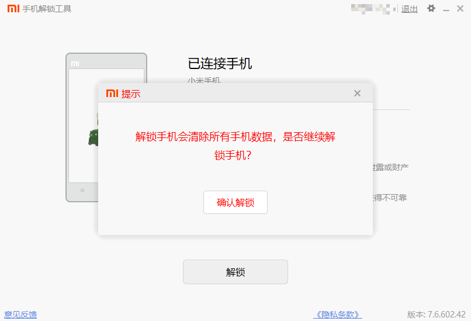

## 说明

[xiaomi.eu（小米欧洲）](https://xiaomi.eu/community/) 是成立于12年前，为国际用户提供英文 MIUI 安卓ROM和小米产品的专属社区，它是小米官方承认的社区，并且它会对小米原生系统进行一些优化，比如内置 google 套件，减少广告 banenr 等。

如果你有 google 套件方面的需求，但同时你的系统为国内 ROM 的话，那么安装 xiao.eu 提供的 ROM，是一个不错的选择， 当然要想成功访问 google，需要有些魔法手段，比如使用一些蹄子，此处不展开。

本篇文档使用的系统为 MIUI 14， ROM 名字： SOCRATES ，版本号： V14.0.23.0。

## 材料
1. 电脑 window 10（或其他系统，如 linux mac）
2. 红米 K60 Pro
3. 数据线
4. socrates TWRP [下载地址](https://sourceforge.net/projects/recovery-for-xiaomi-devices/files/socrates/)
5. socrates ROM [下载地址](https://sourceforge.net/projects/xiaomi-eu-multilang-miui-roms/files/xiaomi.eu/MIUI-STABLE-RELEASES/MIUIv14/)
6. unlock TOOL [下载地址](https://www.miui.com/unlock/index.html)
7. Magisk(Github) [下载地址](https://github.com/topjohnwu/Magisk/releases)
## 步骤

## 0. 准备工作

**手机数据一定要备份。**

**刷机有风险，操作需谨慎。**

**请不要用自己的主力手机尝试，使用备用机。**

解压 miflash_unlock 和 socrates ROM 压缩包，复制一份 twrp 副本，目录如下。


重命名三个文件， 最终如图。


### 1. 解锁 bootloader

在手机上设置中登录可支持解锁小米账号， 并且此账号是跟手机号一一绑定， SIM 卡也必须插入在手机中。

在设置中打开开发者模式， 点击我的设备 -> 全部参数与信息 -> MIUI 版本（连续点击 5 次）。

在设置中搜索设备解锁状态，点击进入，点击绑定账号和设备， 等待提示绑定成功。

当账号与设备绑定成功后，需要 168 个小时（即 7 天）后，才能解锁，期间不要重复绑定。


将手机关机， 同时按住 音量减键 和 电源键 约 5 秒，等待手机屏幕出现 fastboot， 表明此时处于 fastboot 模式。

打开 unlock 文件夹，点击 miflash_unlock.exe 运行程序，登录小米账号。

点击解锁，点击解锁将会清除设备的所有资料，并且系统可能变得不稳定，请谨慎思考后再决定。





提示解锁成功，点击重启手机按钮，将会发现手机界面，顶端出现解锁的图标，表明手机已经完成解锁。


### 2. 刷入 TWRP

关闭手机，照之前的方法，进入 fastboot 模式。

数据线连接电脑和手机。

需要使用 fastboot.exe 刷入 twrp， ROM 解压后的文件中存在此工具。

因此将 twrp.exe 复制到 rom\bin\windows 路径下，如图。


不要直接点击 fastboot.exe 运行 ，而是在此处打开命令行窗口，用 cmd powershell 甚至 git bash 都可以，没有特别要求，只要路径和文件正确即可，，我是使用的 powershell 7 。 输入如下命令。

**注： 如果是其他型号，请查阅 参考 3**

```bash
.\fastboot.exe flash recovery_ab twrp.img
.\fastboot.exe reboot recovery
```

执行完上面两行命令，手机将重启为 Recovery 界面，如果显示如下图片，而不是官方的 recovery 界面，说明第三方 TWRP 安装成功。


### 3. 刷入 ROM

论坛上提供的红米 K60 Pro 的 ROM 包，为 Hybrid 模式，所以同时支持线刷（Fastboot）和卡刷（Recovery），选择其中一种即可。

**注： 如果你已经是欧洲版 ROM，但是你又想降级或其他版本互转，请在刷机前进入设置退出 google 账号。**

#### 线刷

拔掉 SIM 卡，手机关机，照此前方法，进入 Fastboot 模式。

数据线连接电脑和手机。

进入 xiaomirom 文件夹。

如果是第一次更换系统， 执行 windows_fastboot_first_install_with_data_format.bat ，**此操作同样会清除手机的所有数据**。

如果是升级系统，执行  windows_fastboot_update_rom.bat 。

如果是降级系统或 Weekly ROM 与 Stable ROM 互转，执行 windows_fastboot_first_install_with_data_format.bat  **此操作同样会清除手机的所有数据**。


```bash
.\windows_fastboot_first_install_with_data_format.bat
```


等待命令执行完毕，将自动重启手机，手机初始化如下，按照需求选择即可，关键在于 未检测到 SIM 卡时选择继续 和连接 WIFI 时选择跳过。

**注：因为国内网络默认是访问不了 google 配置，如果连接网络会导致无法完成初始化配置。(如果你能绕过，就忽略此信息)**

完成初始化后，进行系统，再连接网络进行其他配置。


#### 卡刷

卡刷比较简单，不多赘述，查阅参考 5.

## 4. 刷入 Magisk

Magisk 用于 获取手机 root 权限，并向其他软件授予 root 权限。

**ps：root 权限属于高危权限，请谨慎授予。**


从 Github 上下载 Magisk.apk 文件，当前版本为 V26.1

将 Magisk.apk 和 rom\images\init_boot.img 两个文件复制到手机中。手机安装 Magisk 程序

安装如下步骤获取修补文件

1. 手机运行 Magisk 程序
2. 点击安装按钮
3. 选择修补文件
4. 从弹出的文件管理器中，找到并选中 init_boot.img
5. 点击开始按钮
6. 完成后，会在手机的 Download 文件下中得到magisk_patched-[xxx].img 的文件.


将 init_boot.img 和 magisk_patched-xxx.img 两个文件，复制到 rom\bin\windows 路径下，并重命名为 magisk_patched.img 文件。


手机关机后，进入 fastboot 模式。

电脑在此处打开命令行窗口，执行如下命令。

```bash
.\fastboot.exe flash init_boot_ab magisk_patched.img
```

如果刷入了不兼容的 Magisk 模块或其他误操作，发现不能正常开机，那么尝试恢复原先的 boot 镜像。

```bash

.\fastboot.exe flash init_boot_ab init_boot.img
```


打开软件,如果此处有 V26.1 标识，说明安装成功，可以进行其他软件的 root 授权。


## 参考

1. [MIUI 14 STABLE RELEASE](https://xiaomi.eu/community/threads/miui-14-stable-release.67685/)
2. [Custom recovery for Socrates? (Redmi K60 Pro)](https://xiaomi.eu/community/threads/custom-recovery-for-socrates-redmi-k60-pro.69562/)
3. [Installing a Custom Recovery](https://xiaomi.eu/community/threads/installing-a-custom-recovery.67841/)
4. [小米手机详细解 BL 锁教程](https://zhuanlan.zhihu.com/p/465104171)
5. [使用 TWRP 刷 MIUI 开发版方法](https://miuiver.com/install-miui-developer-rom/)
